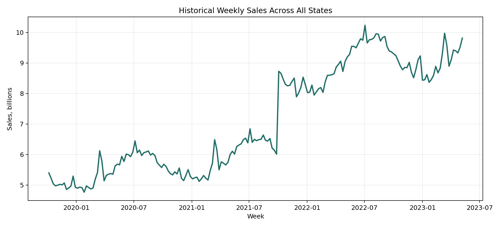
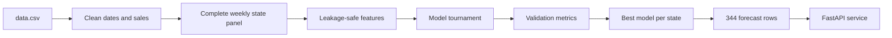
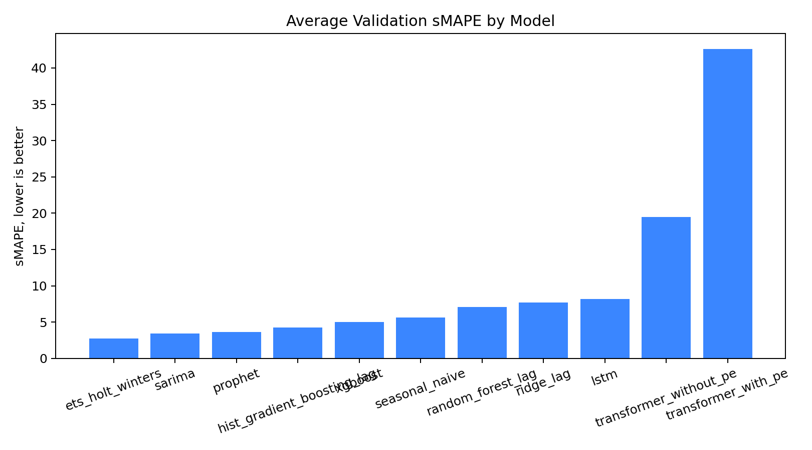
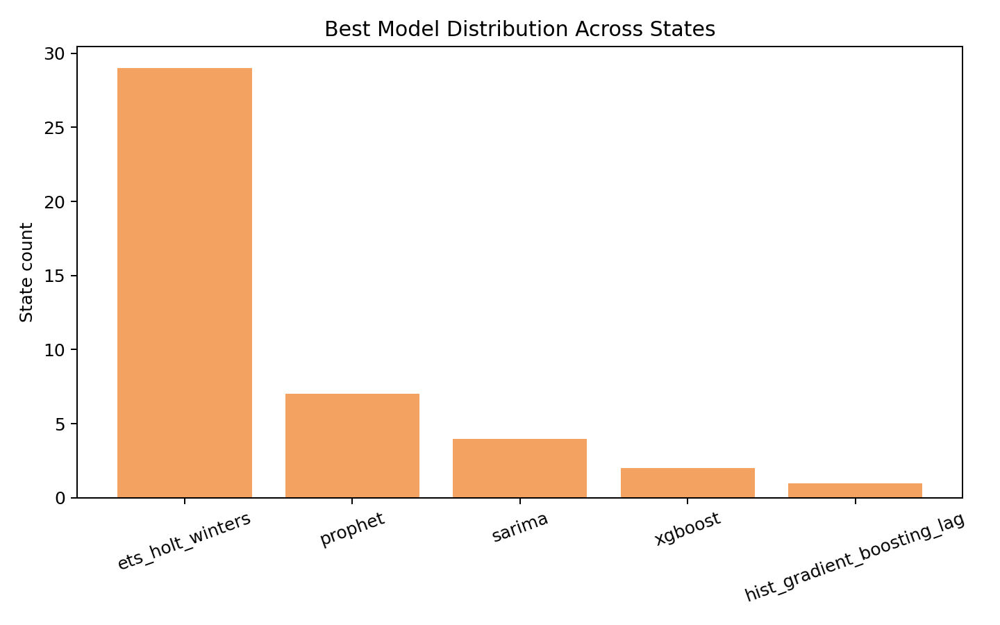
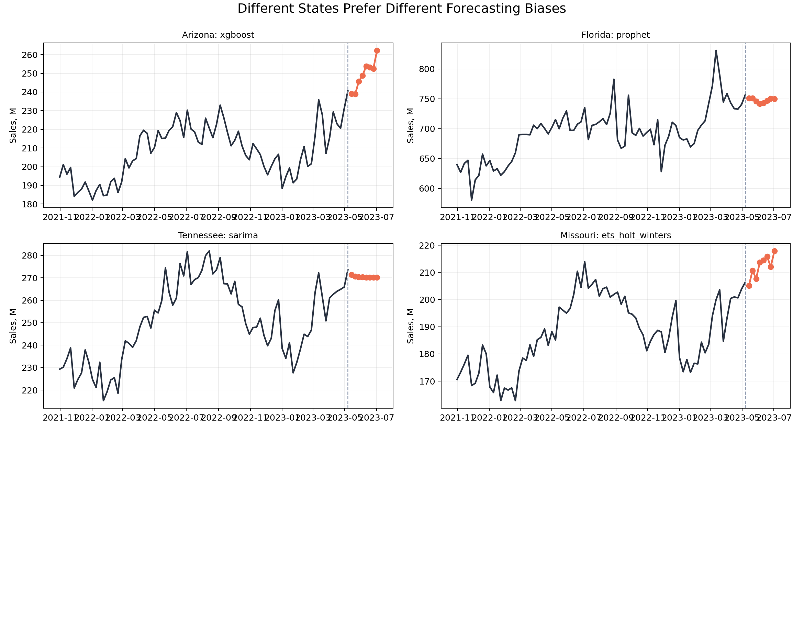
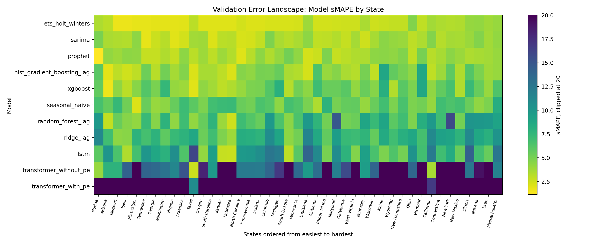
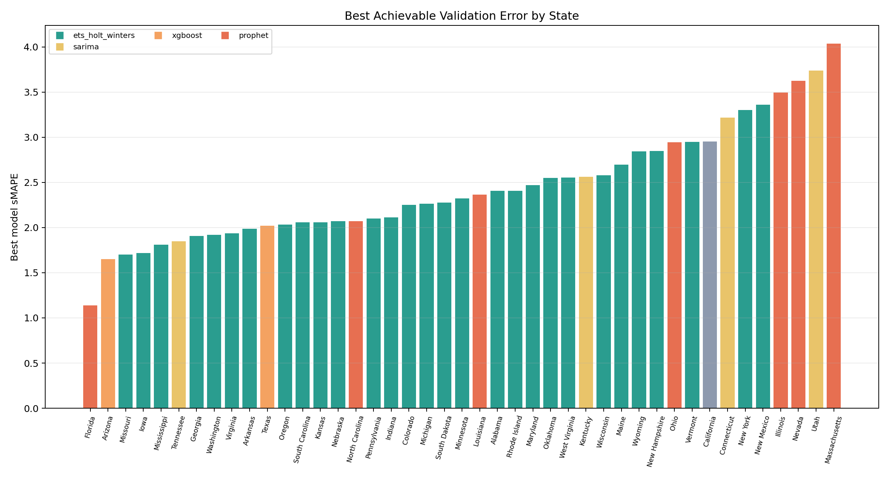
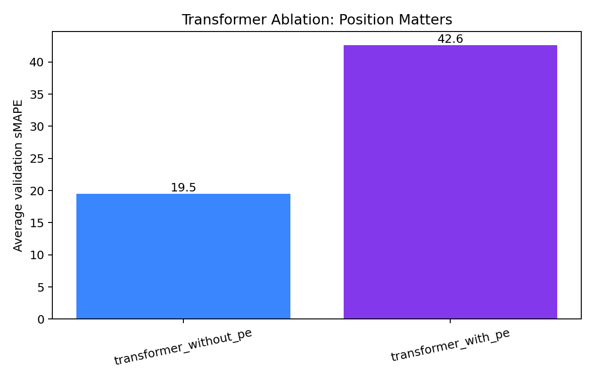
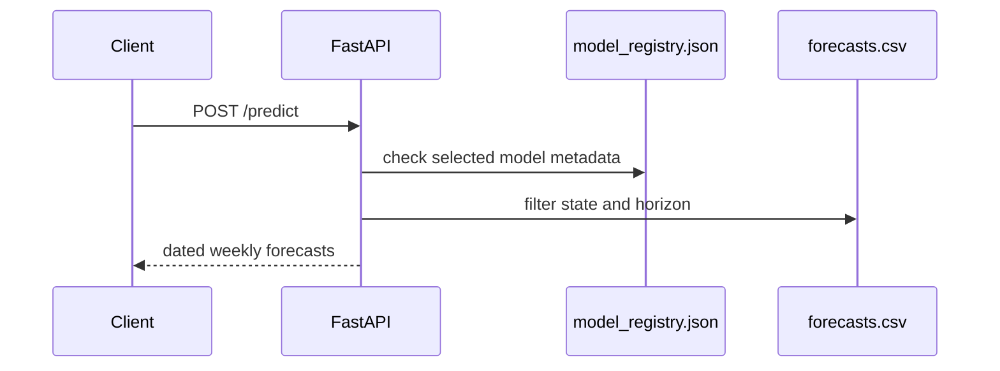

# Forecasting 43 State Sales Series: A Small Production System

This project is an end-to-end forecasting service which is able to: predict the next **8 weeks of sales for every state**, compare several model families, automatically select the best model, and expose the resulting forecasts through a REST API.

The implementation is intentionally not a notebook. It is a small backend system: a data loader, a feature pipeline, a model tournament, persisted artifacts, generated diagnostics, tests, and a FastAPI serving layer.

## The Shape Of The Problem

The file looks simple: `State`, `Date`, `Total`, and `Category`. But the first useful observation is hidden in the date column. The strings mix `/` and `-`, and `1/12/2019` is ambiguous until you parse the whole file. Interpreting dates as day-first gives a perfect weekly Sunday series:

| Property | Value |
|---|---:|
| Rows | 8,084 |
| States | 43 |
| Category | `Beverages` |
| Date range | `2019-10-06` to `2023-05-07` |
| Weekly timestamps | 188 |
| Missing state-week rows | 0 |
| Forecast horizon | 8 weeks |

That changes the mental model. This is not 43 arbitrary tables. It is a rectangular panel: 43 parallel weekly series, each with the same calendar. That gives us two useful options at the same time:

- Fit state-local time-series models that specialize to one state.
- Fit global supervised models that borrow signal across states.

The system does both.



The aggregate series has a smooth upward trend with recurring seasonal structure. That is why the final model pool includes old-school time-series methods, tree models on lag features, neural sequence models, and a Transformer ablation. The point is not to make the fanciest model win. The point is to make the comparison fair enough that the data can tell us what kind of bias it wants.

## The Pipeline



The training split is deliberately boring:

- Train through `2023-03-12`.
- Validate on `2023-03-19` through `2023-05-07`.
- Forecast `2023-05-14` through `2023-07-02`.

The important detail is that all lag and rolling features are computed from the past only. For recursive models, future steps use earlier predictions as history. No validation row is allowed to leak into the features used to predict it.

## The Model Tournament

The assignment requires SARIMA or ARIMA, Prophet, XGBoost, and LSTM. I kept those, then added models that are relevant for weekly sales:

| Model | Why it belongs here |
|---|---|
| `seasonal_naive` | Hard-to-beat yearly seasonal baseline. |
| `sarima` | Compact ARIMA-style statistical model for trend and autocorrelation. |
| `ets_holt_winters` | Classical trend plus seasonal smoothing. |
| `prophet` | Piecewise trend and holiday-aware seasonality. |
| `xgboost` | Nonlinear global lag-feature model. |
| `random_forest_lag` | Robust nonlinear tabular baseline. |
| `hist_gradient_boosting_lag` | Fast boosted-tree alternative. |
| `ridge_lag` | Linear regularized sanity check. |
| `lstm` | Neural sequence model over 52-week windows. |
| `transformer_with_pe` | Attention model with sinusoidal positional encoding. |
| `transformer_without_pe` | Same attention model without position information. |

The model-selection metric is **sMAPE**, because the states have very different sales scales. MAE, RMSE, and MAPE are still saved in `artifacts/metrics.csv`.

The average validation result is:

```text
ets_holt_winters               2.723
sarima                         3.418
prophet                        3.630
lstm                           4.008
hist_gradient_boosting_lag     4.278
xgboost                        5.005
seasonal_naive                 5.660
random_forest_lag              7.060
ridge_lag                      7.681
transformer_with_pe           18.178
transformer_without_pe        23.546
```



The headline is useful but incomplete. ETS/Holt-Winters wins on average because this dataset is clean, weekly, and seasonal. That is exactly the kind of setting where exponential smoothing is still very hard to beat. But a single global leaderboard hides the more interesting fact: different states prefer different inductive biases.

## The Best Model Is Not One Model

The final selection is done per state. That produces this distribution:

```text
ets_holt_winters       26
lstm                    8
sarima                  4
xgboost                 2
prophet                 2
transformer_with_pe     1
```



ETS dominates, but it does not monopolize the problem. LSTM wins 8 states. ARIMA wins 4. XGBoost wins Arizona and Texas. Prophet wins Florida and Louisiana. The Transformer with positional encoding wins California.

That last sentence is a good example of why the tournament matters. If we only reported the average model score, the Transformer looks weak. If we only shipped one model globally, we would miss the fact that attention with positional information found the best validation fit for the largest state in the dataset.



The small multiples show the production behavior: the API does not care whether a state was won by ETS, LSTM, Prophet, XGBoost, SARIMA, or Transformer. It serves a common forecast contract: state, date, forecast, selected model.

## Where The Errors Live

This heatmap is the most honest diagnostic in the project. Each row is a model. Each column is a state. Columns are ordered from easiest to hardest by the winning model’s validation sMAPE.



Several patterns show up:

- The classical models form the strongest low-error band.
- The tree models are competitive but not dominant.
- The LSTM is not just decorative; it wins a meaningful cluster of states.
- The Transformer with PE is much better than the Transformer without PE.
- The no-PE Transformer is the right ablation to include because it shows that attention alone is not enough; order information matters.

The easiest state in validation is Florida with Prophet at `1.14` sMAPE. The hardest winner is Massachusetts with LSTM at `3.84` sMAPE. That range is small enough to be useful: the best model per state generally stays under 4 percent sMAPE on the validation window.



This chart is the practical view for stakeholders. It answers: after model selection, which states are still hard? The answer is not “the largest states.” Error is about shape, not just volume.

## A Transformer Footnote That Is Actually Useful

I added two Transformer models because it is a good ablation for sequence forecasting:

- `transformer_with_pe`: attention over 52-week windows plus sinusoidal positional encoding.
- `transformer_without_pe`: same architecture, but no positional encoding.

The result:

```text
transformer_with_pe       18.18 sMAPE
transformer_without_pe    23.55 sMAPE
```



Both are worse on average than simpler models. That is not a failure; it is a useful result. This dataset has only 188 weekly timestamps per state. Transformers like data. On this problem, the attention model is mostly over-parameterized. But positional encoding still helps substantially, and the PE version wins California. The ablation teaches something: if we are going to use attention on time series, we must give it time.

## The Final Artifact

After validation, each state is assigned its best model and forecasted for the next 8 Sundays. The final forecast artifact has:

```text
43 states * 8 weeks = 344 forecast rows
forecast window: 2023-05-14 to 2023-07-02
successful models: 11
training failures: 0
```

The registry at `artifacts/model_registry.json` records:

- Dataset profile.
- Validation horizon.
- Attempted models.
- Successful models.
- Failure messages, if any.
- Selected model per state.
- Forecast window.

## Serving The Forecasts

The API is intentionally artifact-first. Training can be slow, especially with Prophet and neural models. Serving should be fast and predictable. So the service loads validated artifacts and returns precomputed forecasts.



Run the service:

```bash
python -m microgcc serve --artifacts artifacts --host 0.0.0.0 --port 8000
```

Predict California:

```bash
curl -X POST http://localhost:8000/predict \
  -H "Content-Type: application/json" \
  -d '{"state":"California","horizon":8,"model":"best"}'
```

Predict every state:

```bash
curl -X POST http://localhost:8000/predict \
  -H "Content-Type: application/json" \
  -d '{"state":null,"horizon":8,"model":"best"}'
```

Example response shape:

```json
{
  "horizon": 8,
  "count": 8,
  "predictions": [
    {
      "state": "California",
      "date": "2023-05-14",
      "forecast": 481234567.0,
      "model": "transformer_with_pe"
    }
  ]
}
```

## Reproduce The Run

The current environment uses Python `3.12.10` with TensorFlow `2.21.0`.

```bash
uv venv --python /home/ryyan/.pyenv/versions/3.12.10/bin/python
source .venv/bin/activate
uv pip install -e ".[deep-learning,dev]"
```

Train all models:

```bash
python -m microgcc train --data data.csv --out artifacts
```

Generate the figures:

```bash
python -m microgcc visualize --data data.csv --artifacts artifacts --out reports/figures
```

Generate a short project demo video:

```bash
python scripts/make_demo_video.py \
  --artifacts artifacts \
  --figures reports/figures \
  --output reports/video/microgcc_demo.mp4
```

Evaluate:

```bash
python -m microgcc evaluate --artifacts artifacts
```

Run tests:

```bash
pytest -q
```

Current verification:

```text
5 passed
metric rows: 473 = 43 states * 11 models
forecast rows: 344 = 43 states * 8 weeks
failures: {}
```

## What I Would Do Next

The next production step is not “add a bigger model.” It is to improve the evaluation loop:

- Add rolling-origin backtests instead of one validation window.
- Add prediction intervals, especially for API consumers.
- Store model artifacts in a real registry such as MLflow.
- Schedule retraining when new weekly data arrives.
- Add monitoring for drift in sales level, seasonality, and forecast error.

The main lesson from this dataset is simple: a good forecasting system is not a single clever model. It is a disciplined comparison harness. Once that harness exists, ETS, LSTM, Prophet, XGBoost, SARIMA, and even a Transformer can all compete under the same rules, and the API can serve the winner without caring how it was made.
